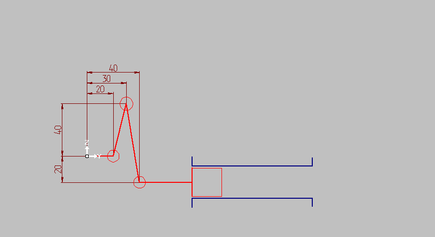
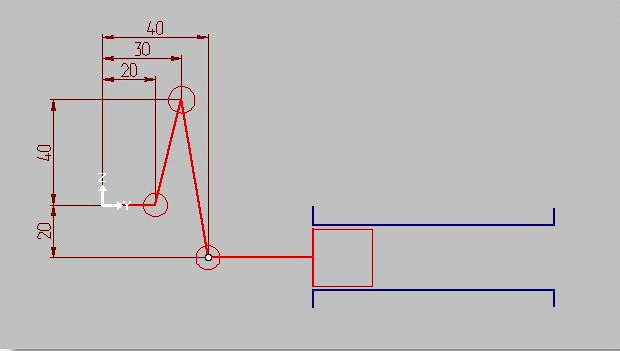
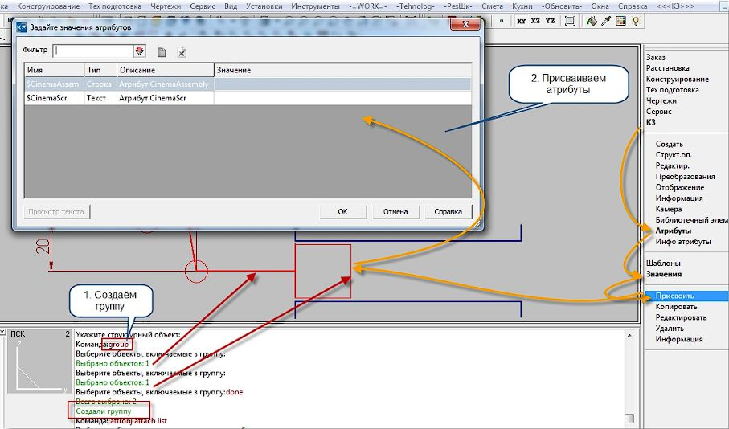
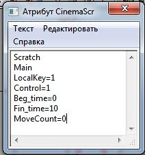
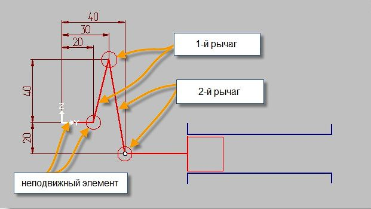
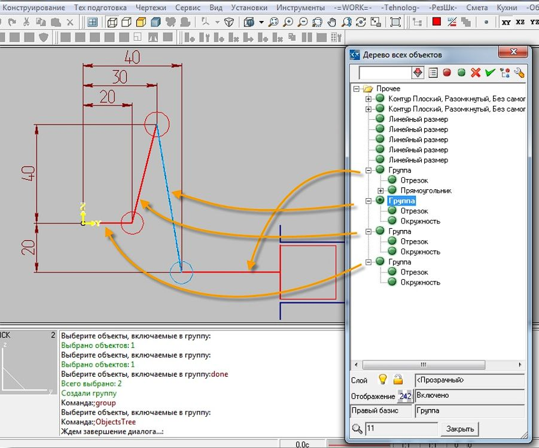
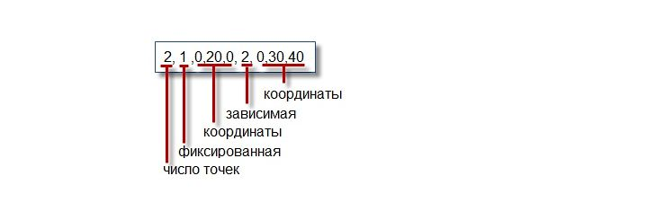
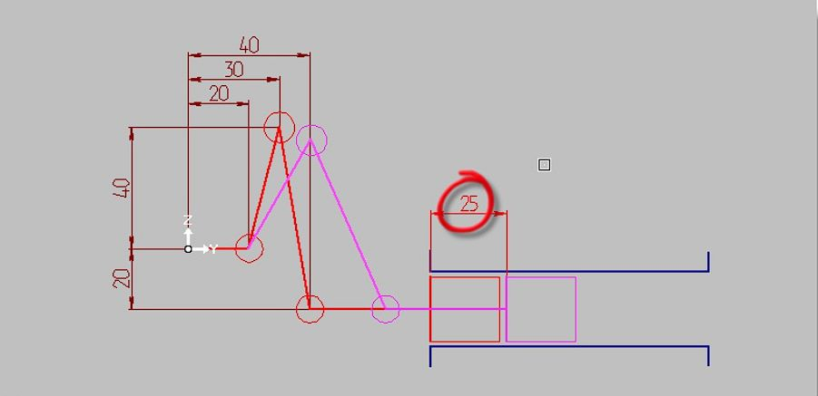

# Cinema часть 1

*Разбор правил формирования атрибутов трансформации элементов конструкции для имитации открывания/закрывания дверок, ящиков и т.п.*

## Введение

Для получения правильного результата трансформации элементов в K3 необходимо правильно присвоить атрибуты `$CinemaAssem` и `$CinemaScr` группе объектов. Эти атрибуты определяют движение объектов при динамической визуализации.

## Пример: Линейное перемещение поршня



## Не самый простой случай с линейным перемещением

Судя по документации, что бы получить правильный результат трансформации надо:

1. Присвоить группе или можно её назвать основному верхнему объекту два атрибута `$CinemaScr`, `$CinAsseGr`

1. Внутри этой группы, подчиненным объектам, присвоить атрибуты `$CinemaAssem` с указанием типов *(управляющая, зависимая, фиксированная)* точек с какими то там координатами.
Создадим примитивный поршень, который будет совершать поступательное и возвратное движение. Примерно такой, как изображен на рисунке.



### Создание управляющего объекта

Соберем в группу прямоугольник со штоком. Это будет *Управляющий объект* с управляющей точкой с координатами `0, 40, -20`. Присвоим этой группе (поршень со штоком) атрибут `$CinemaAssem` и `$CinemaScr` Поскольку это управляющий объект, а именно этот тип объекта задаёт движение всех зависимых.

1. Создадим *Управляющий объект* Поршень со штоком.

    Используем меню `К3/Структ.оп./Группа/Создать` Или через командную строку набираем на клавиатуре:`group` указываем шток и прямоугольник и жмем правую кнопку мыши выбираем `закончить`.

1. Присвоим ему атрибуты `$CinemaAssem` и `$CinemaScr`



Поскольку, это *управляющий объект*, то значения атрибутов у него особенные. Для `$CinemaAssem` используем второй вариант записи См.[документацию](https://u.to/tXBVIg)

Если на объекте есть атрибуты `$CinemaAssem` и `$CinemaScr`, значит этот объект является управляющим, и в его атрибуте `$CinemaAssem` записаны координаты управляющей точки. т.е. положение этого объекта (и управляющей точки) рассчитывается командой cinema, и потом передаётся в решатель, для определения положения зависимых объектов.

    1, -1 - зарезервированные значения
    x, y, z - координаты управляющей точки

    1, -1, x, y, z

### Структура атрибута

В нашем случае `$CinemaAssem` получается `1,-1,0,40,-20`

Второй атрибут уже текстовый. Это так называемый Scrath. Что это такое можно почитать на страничке [документации](https://u.to/wnBVIg).
`$CinemaScr` сложнее и проще одновременно.

Шапка у него стандартная **Scratch**

Далее имя секции **Main**

    LocalKey - Признак, нужно ли применять преобразование у подчиненного объекта: 1-нужно
    Control - Подчиненность объекта: 1 - подчиненный (берет информацию о движении от «босса»)
    Beg_time - Общее время начала движения
    Fin_time - Общее время окончания движения
    MoveCount - Количество движений: поворотов и перемещений.



### Создание зависимых объектов

Для 2-х рычагов определяем `$CinemaAssem`

Соберем для наглядности 1 окружность и 1 линию в группу и назовем это рычаг.

Получим два рычага. 3-й элемент будет неподвижным.



По аналогии с поршнем вызываем `group` и указываем линию и окружность входящую в рычаг.
Повторяем еще два раза.

Структура сцены



### Неподвижный элемент

3-й элемент неподвижный, поэтому ему ничего не присваиваем.

1-й рычаг приобретает `$CinemaAssem` 1-го варианта у него две точки в подчинении.

Одна фиксированная( тип-1) и вторая зависимая (тип-2)

Структура атрибута:

n, t1, x1, y1, z1, t2, x2, y2, z2...

    n - число точек
    ti - тип i-ой точки
    0 - управляющая
    1 - фиксированная
    2 - зависимая
    xi, yi, zi - координаты i-ой точки



`2,1,0,20,0,2,0,30,40`

Второму рычагу аналогично присваиваем строку из управляющей и зависимой точки

`2,0,0,40,-20,2,0,30,40`
Заметно, что у них есть одна общая зависимая точка **0,30,40**

В отличии от первого рычага вместо фиксированной, вторая точка управляющая.

Теперь всё это(поршень, 2 рычага и третий неподвижный) собираем в группу и назначаем этой группе атрибуты `$CinemaScr`, `$CinAsseGr`

```    
Scratch
Main
Control=2
Beg_Time=0
Fin_Time=10
Dir_Time=1
MoveCount=1
Move0
LocalKey=1
MoveBeg=0
MoveEnd=10
MoveType=0
MoveX=0
MoveY=25
MoveZ=0
```

В $CinemaScr записываем данные для решателя
Это содержимое $CinemaScr. Описано задание решателю сдвинуть уравляющую точку на 25 мм по оси Y

На картинке показан исходный и финальный момент сдвига.




## Заключение

Правильное использование атрибутов `$CinemaAssem` и `$CinemaScr` позволяет создавать сложные динамические сценарии в K3. Для более подробного изучения рекомендуется ознакомиться с официальной документацией на [странице Cinema](https://u.to/_2xVIg).
