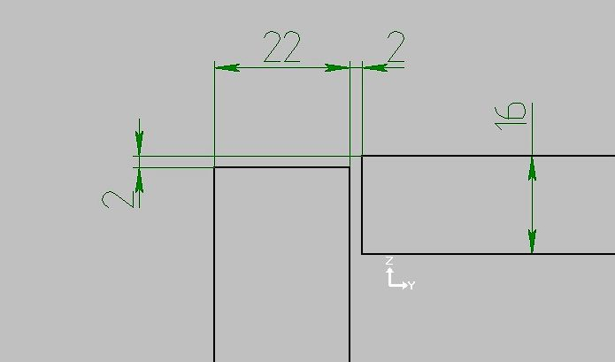
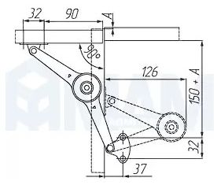
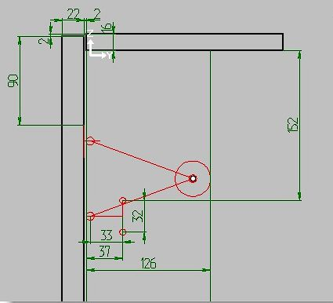
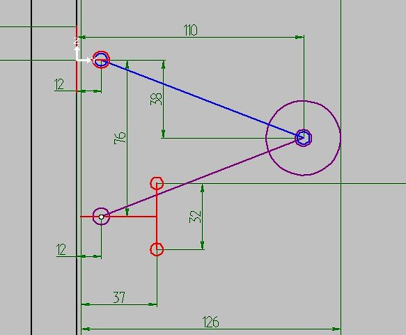
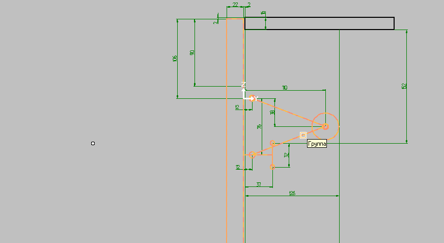
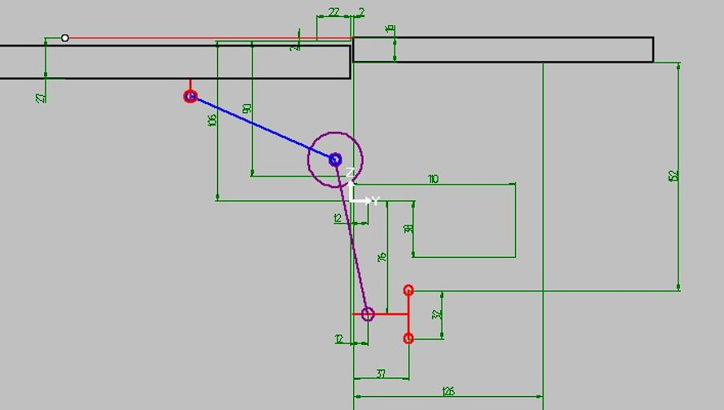

# Cinema часть 2

## Похожий на KLOK механизм подъемный или откидной (ДСП) из МДМ

[Страничка](https://www.mdm-complect.ru/catalog/lifty-i-podemnye-mekhanizmy/67816/) механизма на сайте МДМ

Судя по описанию на сайте МДМ этот механизм реализует 5 вариантов установки.

- 3 открывания вверх
- 2 открывания вниз

Так что поле для деятельности велико. Надо как то реализовать вариантность установки и визуализации открывания.

В Механизме есть ещё два подчиненных рычага.

Нижний обладает способностью вращаться вокруг оси зафиксированного кронштейна. У этого кронштейна нет никаких атрибутов и поэтому он вместе с "Боссом" никуда не шевелится. Верхний связан с кронштейном, который крепится к фасаду и осуществляет сложное поворотное движение.

Это одна номенклатурная единица, которая может быть установлена пятью различными способами. Кроме того, в зависимости от веса дверки может ставиться два или один механизм.

Начнем не спеша с разбора и моделирования кинематики.

Представим вертикальный фасад и верхнюю панель , что бы было понятно, что-как и почему.



Начнем с варианта 90.



К сожалению на схеме нет размеров осей, поэтому постараемся определить их сами.

Вот что в итоге вышло у меня. Думаю, что для моделирования кинематики достаточно.




Для простоты описания точек смещаем всё это в ГСК точкой на фасаде напротив будущей управляющей точки (0) `0,12,0`.

Нижний кронштейн не движется ему ничего не присваиваем.
Нижний рычаг (фиолетовый) содержит фиксированную точку (1) `0,12,-76`
Оба рычага содержат зависимую точку (2) `0,110,-38`
Верхний рычаг (синий) содержит управляющую точку (0) `0,12,0`

Присваиваем рычагам `$CinemaAssem`:

Нижнему `2,1,0,12,-76,2,0,110,-38`
Верхнему `2,0,0,12,0,2,0,110,-38`
Верхнему кронштейну `$CinemaAssem` и `$CinemaScr`

Поскольку это управляющий объект пишем в него:

`$CinemaAssem` 1,-1,0,12,0
`$CinemaScr`

```
Scratch
Main
Control=1
```

Собираем всё в группу и присваиваем группе `$CinemaScr`, `$CinAsseGr`

**$CinemaScr**

```
Scratch
Main
Control=2
Beg_time=0
Fin_time=1000
Dir_time=1
MoveCount=2
Move0
LocalKey=1
MoveBeg=0
MoveEnd=1000
MoveType=1
Axe1X=0
Axe1Y=0
Axe1Z=106
Axe2X=2
Axe2Y=0
Axe2Z=106
Angle=-90
Move1
LocalKey=1
MoveBeg=0
MoveEnd=1000
MoveType=0
MoveX=0
MoveY=0
MoveZ=-14
```

Для плавности работы назначаю 1000 мС для `Fin_time` и `MoveEnd`.

Два движения `MoveCount=2`
Первое движение поворот `MoveType=1`
Угол открывания -90 (по часовой стрелке) вокруг оси с точками `(0, 0, 106) (2, 0, 106)`

Второе движение перемещение `MoveType=0` по оси Z **-14 мм**

## Результат описания движения

Для наглядности, добавил прямоугольник в состав верхнего кронштейна, который является Управляющим объектом



Обратите внимание, как внутренний угол опускается и дверь открывается в одной плоскости с верхней панелью.

Но петля обычно работает для панелей (фасадов) толщиной до 25 мм поэтому второе движение `MoveZ=` должно быть скорее **-25** мм, вместо **-14**


