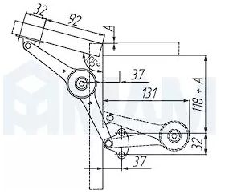
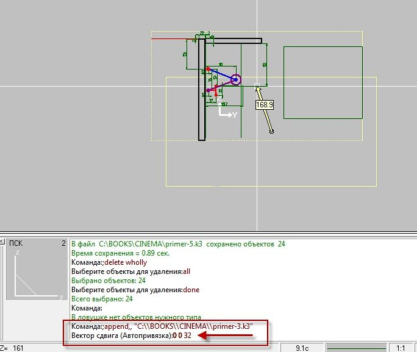
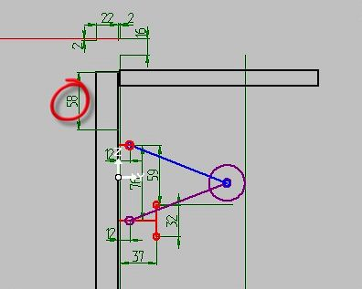
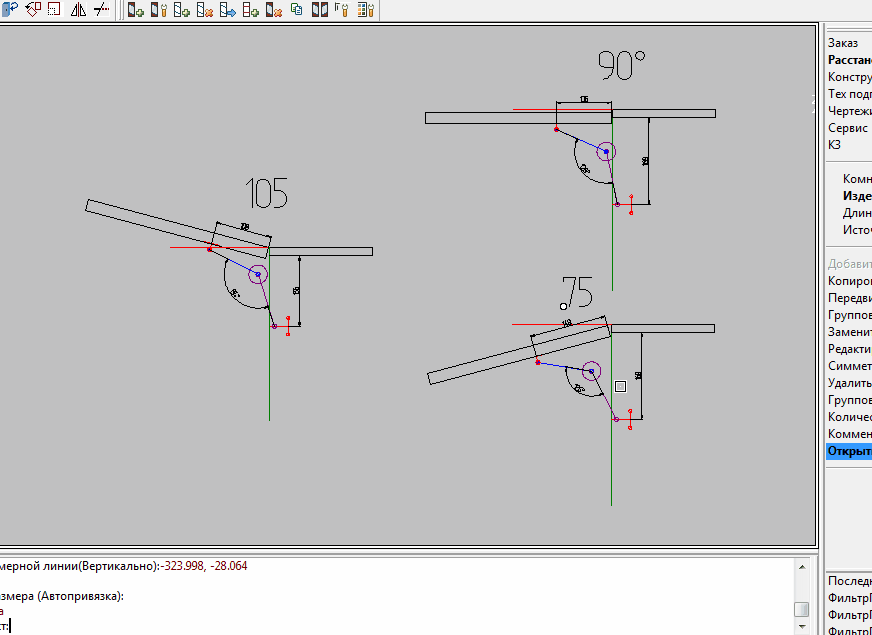

# Cinema Часть 3

## Вариант 105 градусов



В этом варианте точка неподвижного кронштейна изменяет свое положение вместо `150+А` рекомендуют `118+А`.
Разница составляет `+32` мм по оси **Z**. Создадим новый файл и добавим в него файл с механизмом при этом точку установа сдвинем `0,0,32`. После чего скорректируем прямоугольники имитирующие панели на вектор `0,0,-32`.



Как видно на следующем рисунке управляющая точка тоже сдвинулась на `32` мм и получился размер `58`, а судя по схеме нам нужен `92`.



Проделаем схожую процедуру с предыдущей частью и скорректируем управляющую точку на `-34` по оси **Z**

*Не забываем исключить прямоугольник имитирующий фасад из верхнего кронштейна*

После чего возвращаем фасад на место в группу. И редактируем атрибут.

Я посмотрел повнимательнее на динамику и пришлось подкорректировать последнее движение по оси **Y** в `-4` Что бы угол фасада не сталкивался с верхней панелью.

Кроме того, точка оси поворота не `106`, а `108`

Окончательный вариант
```
Scratch
Main
Control=2
Beg_time=0
Fin_time=100
Dir_time=1
MoveCount=2
Move0
LocalKey=1
MoveBeg=0
MoveEnd=100
MoveType=1
Axe1X=0
Axe1Y=0
Axe1Z=108   <---------
Axe2X=2
Axe2Y=0
Axe2Z=108  <----------
Angle=-105
Move1
LocalKey=1
MoveBeg=0
MoveEnd=100
MoveType=0
MoveX=0
MoveY=-4 <---------
MoveZ=-21
```

Результат для всех трех случаев

 
 
