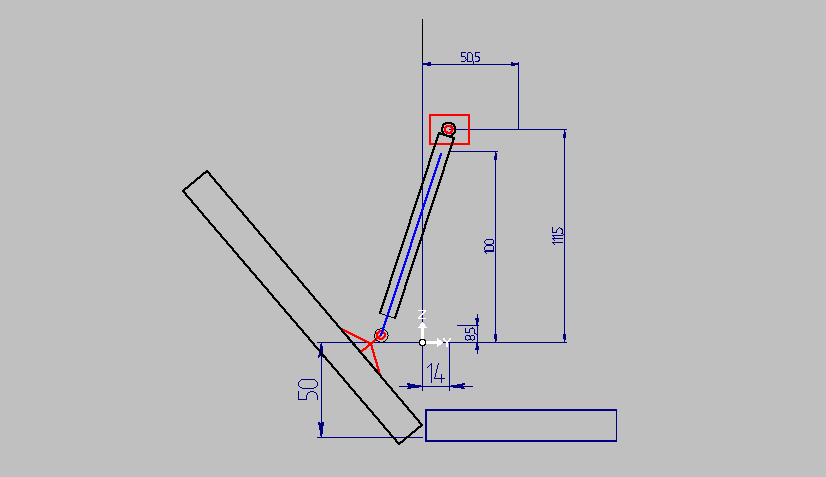
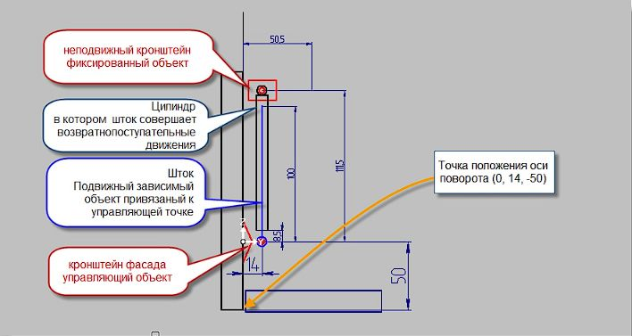

# Cinema Часть 4

:::{epigraph}
"Чем кратче и яснее изъяснение, тем скорее достигается цель"

--- И.И. Яндекс
:::

## Разбор теории работы механизма "Газовый лифт"
 

**Кронштейн фасада**-- *(выделен красным)* управляющий объект на конце цепочки группы объектов образующих сущность "Газовый лифт".





Ему необходимо присвоить два атрибута `$CinemaAssem` и `$CinemaScr`

Поскольку это управляющий объект пишем в него:

- `$CinemaAssem` 1,-1,0,14,0
- `$CinemaScrScratch`
    - Main
    - Control=1

**Шток** -- *(выделен синим)* одной точкой связан с управляющим объектом, другая точка зависимая (тип-2) на оси штока.

Пишем в него:

`$CinemaAssem` `2,0,0,14,0,2,0,14,100`

**Цилиндр** -- имеет неподвижную точку (тип-1) на оси неподвижного кронштейна и зависимую на любом месте оси совпадающей со штоком.

Пишем в него:

`$CinemaAssem` `2,1,0,14,111.5,2,0,14,100`
**Неподвижный кронштейн** -- пишем две неподвижные точки (так надо в предыдущих частях так не делал)

`$CinemaAssem` `2,1,0,14,111.5,1,0,50,100`

Всё собираем в группу присваиваем два атрибута

`$CinAsseGr` -- логический

`$CinemaScr`
```
Scratch
Main
Control=2
Beg_time=0
Fin_time=1000
Dir_time=1
MoveCount=2
Move0
LocalKey=1
MoveBeg=0
MoveEnd=1000
MoveType=1
Axe1X=0
Axe1Y=0
Axe1Z=-50
Axe2X=2
Axe2Y=0
Axe2Z=-50
Angle=90
Move1
LocalKey=1
MoveBeg=0
MoveEnd=1000
MoveType=0
MoveX=0
MoveY=0
MoveZ=22
```
