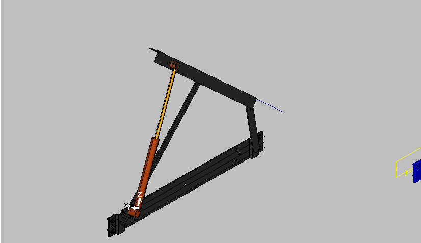
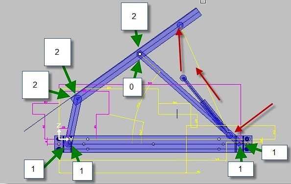

# Cinema Часть 5

:::{epigraph}
Инженер видит в механизме не только движение, но и законы, по которым оно возможно.

--- И.И. Яндекс
:::

## Сложный объект

Ниже представлен подъёмный механизм для кровати.

Что бы построить такой, достаточно сложный объект, следует назначить три комплекта атрибутов Cinema

- Рычажной трапеции, которая состоит из:
    - Базовой (неподвижной) планки;
    - Верхнего (подвижного) опорного уголка;
    - Заднего короткого рычага;
    - Переднего длинного рычага;
- Газового лифта;
(*В который входит два подвижных зависимых элемента*):
    - Шток;
    - Цилиндр;

Шток связан подвижной осью с верхним опорным уголком. А цилиндр установлен на передний рычаг.

Сложность в том, что у газового лифта нет фиксированной точки.

Типы точек на рычагах трапеции выглядят так

Красными стрелками показаны точки элементов газового лифта, которые не удается связать с точками рычажной трапеции. И для имитации работы газового лифта придется описывать эти элементы как самостоятельные объекты Control=0
